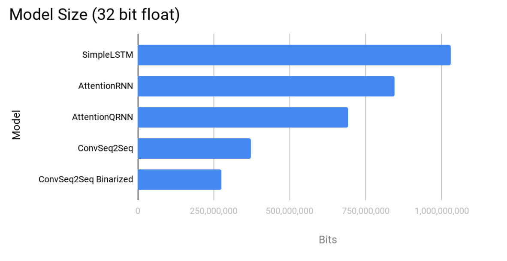

# Binarized Neural Machine Translation

We explore ways to reduce computation and model size for neural machine translation. With the development of binary weight networks and XNOR networks in vision, we attempt to extend that work to machine translation. In particular, we evaluate how binary convolutions can be used in machine translation and their effects.

* [Paper](BinarizingNMT.pdf)
* [Poster](poster.pdf)

## Datasets

Although our analysis is done on Multi30k dataset, our code supports the following datasets:

* WMT 14 EN - FR
* IWSLT
* Multi30k

## Models

### Baseline Models

We implement 4 baseline models to compare our binarized models against.

#### Simple LSTM


An encoder decoder model, that encodes the source language with an LSTM, then presents the final hidden state to the decoder. The decoder uses the final hidden state to decode the output.

#### Attention RNN


An encoder decoder model, similar to the last but at every decoder step applies an attention mechanism over all the encoder outputs conditioned on the current hidden state.

#### Attention QRNN

The same model as above, but using QRNN (Quasi Recurrent Neural Network developed by Salesforce Research) instead of LSTMs. QRNN should be much faster since the rely on lower level convolutions and can be parallelized further than Attention RNN.

#### ConvS2S


This model (implemented by FAIR) rather than using RNNs, creates a series of convolutional layers that are used for the encoder, and decoder along with attention.

### Binarized Models

We implement two variants of binarized networks to compare performance.

#### ConvS2S Binarized Weight Networks

This
model is the same as the one implemented above, with one key difference. All the weights are represented as a binary tensor β, and a normalization vector such that `W ≈ β · α`. The benefit here is that a convolution can be estimated as `(I · β) · α`

#### ConvS2S XNOR network

This model extends upon the binarized weight network. The input is binarized as well so the convolutions can be estimated as `(sign(I) · sign(β)) · α`.

## Notable Results

### Translation Performance


**Other stats can be found in this [issue](https://github.com/AkshatSh/BinarizedNMT/issues/16)**

### Model Size
We compare model size of two different sets of models. First the models we ran our Multi30k experiments on. Then the large models. Since our dataset is quite a bit smaller, we also ran experiments on the size of the models that are used for larger translation datasets such as WMT, and note the hyper parameters reported in their papers.




## Set Up

A short cut to do all the setup:

```bash

# creates a virutal environment and downloads the data
$ bash setup.sh

```

To set up the python code create a python3 environment with the following:

```bash

# create a virtual environment
$ python3 -m venv env

# activate environment
$ source env/bin/activate

# install all requirements
$ pip install -r requirements.txt
```

If you add a new package you will have to update the requirements.txt with the following command:

```bash

# add new packages
$ pip freeze > requirements.txt
```

And if you want to deactivate the virtual environment

```bash

# decativate the virtual env
$ deactivate

# if using python 3.7.x, no official tensorflow distro is available so use this for mac:
$ pip install https://storage.googleapis.com/tensorflow/mac/cpu/tensorflow-0.12.0-py3-none-any.whl

# use this for linux
$ pip install https://github.com/adrianodennanni/tensorflow-1.12.0-cp37-cp37m-linux_x86_64/blob/master/tensorflow-1.12.0-cp37-cp37m-linux_x86_64.whl?raw=true
```

## References

1. Attention and Simple LSTM [Pictures](https://medium.com/syncedreview/a-brief-overview-of-attention-mechanism-13c578ba9129)

2. FairSeq ConvS2S Gif [Original](https://raw.githubusercontent.com/pytorch/fairseq/master/fairseq.gif)

### Papers

1. XNOR - Net: [Paper](https://arxiv.org/abs/1603.05279)
2. Multi bit quantization networks: [Paper](https://arxiv.org/pdf/1802.00150.pdf)
3. Binarized LSTM Language Model: [Paper](http://aclweb.org/anthology/N18-1192)
4. Fair Seq Convolutinal Sequence Learning: [Paper](https://arxiv.org/pdf/1705.03122.pdf)
5. Quasi Recurrent Networks: [Paper](https://arxiv.org/abs/1611.01576 )
6. WMT 14 Translation Task [Paper](http://www.statmt.org/wmt14/translation-task.html)
7. Attention is all you need [Paper](https://arxiv.org/abs/1706.03762)
8. Imagination improves multimodal translation [Paper](https://arxiv.org/abs/1705.04350) 
9. Multi30k dataset [Paper](https://arxiv.org/abs/1605.00459) 
10. IWSLT [paper](http://workshop2017.iwslt.org/downloads/O1-2-Paper.pdf) 

### Githubs and Links

1. [Pytorch MT Seq2Seq Tutorial](https://pytorch.org/tutorials/intermediate/seq2seq_translation_tutorial.html)
2. [XNOR-net AI2](https://github.com/allenai/XNOR-Net)
3. [Annotated Transformer (Harvard NLP)](http://nlp.seas.harvard.edu/2018/04/03/attention.html)
4. [Salesforce QRNN Pytorch](https://github.com/salesforce/pytorch-qrnn)
5. [Fair Seq](https://github.com/pytorch/fairseq)
6. [Torchtext](https://github.com/pytorch/text)
7. [XNOR NET Pytorch](https://github.com/jiecaoyu/XNOR-Net-PyTorch)
